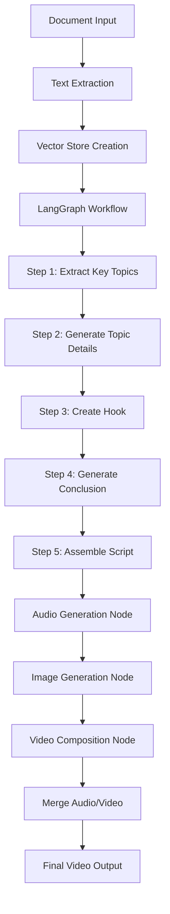

#  AI-Powered Text-to-Video Generation Pipeline

An end-to-end automated system that transforms documents (PDF, DOCX, TXT) into engaging explainer videos with professional narration, synchronized subtitles, and AI-generated visuals.

##  Table of Contents

- [Overview](#overview)
- [Key Features](#key-features)
- [Real-World Applications](#real-world-applications)
- [Architecture](#architecture)
- [How It Works](#how-it-works)
- [Output Examples](#output-examples)

---

##  Overview

This project automates the entire video creation pipeline using LangGraph and multiple AI services. Simply provide a document, and the system generates a complete 2-3 minute explainer video with:

- **Intelligent Content Analysis**: RAG-powered topic extraction
- **Professional Narration**: High-quality text-to-speech audio
- **AI-Generated Visuals**: Cartoon-style illustrations
- **Synchronized Subtitles**: Accurate timestamped captions
- **Animated Compositions**: Smooth transitions and effects

##  Key Features

###  Intelligent Script Generation
- **RAG-Based Analysis**: Uses ChromaDB vector store for semantic document understanding
- **Structured Output**: Pydantic models ensure consistent, high-quality scripts
- **Multi-Stage Processing**: Extracts topics → details → hook → conclusion
- **LangSmith Integration**: Complete observability and tracing

###  Audio Production
- **Multi-Language Support**: Text-to-speech in multiple languages (default: English-India)
- **Natural Narration**: Uses Sarvam AI's Bulbul v2 engine
- **Automatic Timing**: Generates precise timestamps for synchronization
- **Whisper Subtitles**: Optional STT-based subtitle generation

###  Visual Generation
- **AI Image Creation**: Pollinations AI generates cartoon illustrations
- **Smart Background Removal**: Automatic white background elimination
- **Drop Shadows**: Professional image effects
- **Context-Aware**: Images aligned with script content

###  Video Composition
- **Smooth Animations**: Typing effects, fade-ins, slide transitions
- **Professional Layout**: 1280x720 HD resolution
- **Subtitle Overlay**: Animated, easy-to-read captions
- **Multi-Section Structure**: Hook → Topics → Conclusion

---

##  Real-World Applications

### 1. **Educational Content Creation**
- Convert textbooks, research papers, or lecture notes into engaging video lessons
- Create MOOCs and online course materials at scale
- Generate study guides with visual aids

### 2. **Corporate Training**
- Transform company policies, SOPs, and training manuals into digestible videos
- Onboarding materials for new employees
- Compliance and safety training videos

### 3. **Marketing & Social Media**
- Product documentation → promotional explainer videos
- Blog posts → shareable social media content
- White papers → lead generation videos

### 4. **Healthcare & Medical**
- Patient education materials from medical literature
- Pharmaceutical drug information videos
- Public health awareness campaigns

### 5. **Legal & Financial**
- Simplify complex legal documents into accessible formats
- Financial literacy content
- Investment strategy explainers

### 6. **News & Media**
- Rapid video production from breaking news articles
- Documentary-style content from reports
- Investigative journalism visualizations

### 7. **Nonprofit & NGO**
- Awareness campaigns from research reports
- Donor education materials
- Impact story videos

---

##  Architecture



### Technology Stack

**Script Generation Pipeline:**
- `LangGraph`: State machine orchestration
- `LangChain`: LLM framework and RAG implementation
- `ChromaDB`: Vector storage and retrieval
- `Gemini 2.0 / GPT-4o-mini`: LLM for content generation
- `HuggingFace Embeddings`: Text embeddings
- `LangSmith`: Observability and debugging

**Video Production Pipeline:**
- `Sarvam AI`: Text-to-speech narration
- `Pollinations AI`: Image generation
- `Whisper`: Subtitle transcription
- `Pillow (PIL)`: Image processing
- `OpenCV`: Video composition
- `FFmpeg`: Audio/video merging
- `pydub`: Audio manipulation

---

##  How It Works

### Phase 1: Script Generation (LangGraph)

1. **Document Ingestion**
   - Extracts text from PDF/DOCX/TXT
   - Cleans and chunks content
   - Creates ChromaDB vector store

2. **Topic Extraction** (Node 1)
   - RAG retrieval of relevant content
   - LLM identifies 2-4 key topics
   - Generates video title and metadata

3. **Detail Generation** (Node 2)
   - For each topic: retrieves context
   - Creates narration script (30-50s each)
   - Generates 2-3 key points
   - Defines visual descriptions

4. **Hook Creation** (Node 3)
   - 10-second attention grabber
   - Question or surprising statement
   - Sets up video content

5. **Conclusion Generation** (Node 4)
   - 15-second wrap-up
   - Summarizes key takeaways
   - Call-to-action

6. **Assembly** (Node 5)
   - Combines all sections
   - Generates SRT subtitles
   - Creates image prompts list
   - Saves JSON output

### Phase 2: Video Production

1. **Audio Generation** (Node 1)
   - Converts script to speech segments
   - Merges with pauses
   - Generates precise timestamps
   - Creates subtitles via Whisper STT

2. **Image Generation** (Node 2)
   - Generates images via Pollinations AI
   - Removes white backgrounds
   - Adds drop shadows
   - Maps images to topics

3. **Video Composition** (Node 3)
   - Creates gradient backgrounds
   - Animates text (typing effects)
   - Slides in images
   - Fades between sections
   - Overlays subtitles

4. **Merging** (Node 4)
   - Combines video + audio with FFmpeg
   - Exports final MP4

---

## 📺 Output Examples

### Generated Files

```
output/
├── complete_script.json          # Full structured script
├── audio_script.txt              # Plain narration text
├── subtitles.srt                 # Standard subtitle format
├── image_prompts.txt             # Prompts for each visual
├── narration.wav                 # 192kbps audio
├── audio_timestamps.json         # Section timing data
├── image_mapping.json            # Image-to-topic assignments
├── images/
│   ├── hook.png
│   ├── topic_1_visual_0.png
│   ├── topic_1_visual_1.png
│   ├── topic_2_visual_0.png
│   └── conclusion.png
└── final_video.mp4               # 1280x720 @ 30fps
```
---

##  Customization

### Changing Visual Style

**Image Prompts:**
Modify system prompts in `generate_topic_details_node()`:

```python
Visual & Image Guidelines:
- Use realistic photography style instead of cartoons
- Add specific color schemes: "vibrant blue theme"
- Change background: "gradient background" or "office setting"
```

**Video Layout:**
Edit `VideoConfig` for different positioning:

```python
# Move image to left side
IMAGE_X = 60
TEXT_AREA_WIDTH = 1120
TEXT_MAX_X = 1200
```

### Audio Customization

**Voice Selection:**
In `generate_audio_from_descriptions()`:

```python
response = client.text_to_speech.convert(
    target_language_code="hi-IN",  # Hindi
    speaker="meera",                # Different voice
    model="bulbul:v2"
)
```

**Language Options:**
- `en-IN` - English (India)
- `hi-IN` - Hindi
- `ta-IN` - Tamil
- `te-IN` - Telugu
- `bn-IN` - Bengali

### LLM Selection

Switch between models in pipeline files:

```python
# Use Gemini
llm = ChatGoogleGenerativeAI(
    model="gemini-2.0-flash-exp",
    temperature=0.3
)

# Use OpenAI
llm = ChatOpenAI(
    model="gpt-4o-mini",
    temperature=0.3
)
```

---


##  Roadmap

### Version 2.0 (Planned)
- [ ] Real-time video preview
- [ ] Multi-speaker dialogues
- [ ] Advanced animations (pan, zoom, ken burns)
- [ ] Background music generation
- [ ] Branding overlay (logos, watermarks)
- [ ] Export presets (YouTube, Instagram, TikTok)
- [ ] Human In Loop Approval

### Version 3.0 (Future)
- [ ] AI-powered video editing suggestions
- [ ] Automatic B-roll insertion
- [ ] Human avatar narrators
- [ ] Interactive video elements
- [ ] A/B testing for engagement

---

**Made with ❤️ using AI and Python**
